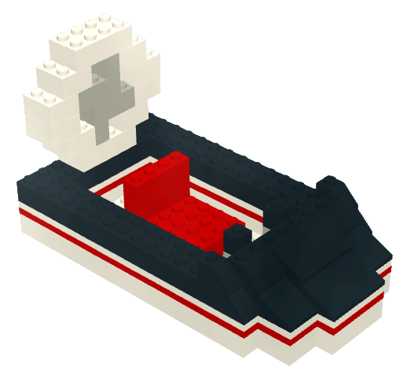

:title: Hovercraft向导
:author: Lennart Regebro（苏卫朋 译）
:description: The Hovercraft! tutorial.
:keywords: presentation, restructuredtext, impress.js, tutorial
:css: tutorial.css

.. header::

    .. image:: images/hovercraft_logo.png

.. footer::

   Hovercraft向导, https://hovercraft.readthedocs.io

This slide show is a sort of tutorial of how to use Hovercraft! to make
presentations. It will show the most important features of Hovercraft! with
explanations.

这个向导向您展示如何使用Hovercraft制作演示文稿，并介绍Hovercraft演示文稿的
重要特点。

Hopefully you ended up here by the link from the official documentation at
https://hovercraft.readthedocs.io/ . If not, you probably want to go there
and read through it first.

希望您已经阅读过官司方链接里的介绍
https://hovercraft.readthedocs.io/ 
如果没有读过，建议先去阅读它。

This tutorial is meant to be read as source code, not in any HTML form, so if
you can see this text (it won't be visible in the final presentation) and you
aren't seeing the source code, you are doing it wrong. It's going to be
confusing and not very useful. Again, go to the official docs. There are
links to the source code in the Examples section.

本教程旨在作为源代码阅读，而不是以任何HTML形式。现在您看到的文本在最终的演示文
稿中是不可见的。如果你觉得没有看到“源代码”，那么你错了，这个文件就是Hovercraft
的源代码。再次，建议去看官方文档，其中有链接到示例部分中的源代码。

You can render this presentation to HTML with the command::

    hovercraft positions.rst outdir

And then view the outdir/index.html file to see how it turned out.

您可以使用以下命令将此演示文稿呈现为HTML::

	hovercraft positions.rst outdir

然后查看outdir / index.html文件以查看结果。

**Now then, on to the tutorial part!**

**现在，开始向导部分!**

The first thing to note is the special syntax for information about the
presentation that you see above. This is in reStructuredText called "fields"
and it's used all the time in Hovercraft! to change attributes and set data
on the presentation, on slides and on images. The order of the fields is not
important, but you can only have one of each field.

首先要注意的是你在上面看到的有关演示文稿信息的特殊语法。这在reStructuredText
中称为“字段”，Hovercraft使用这些字段在演示文稿（幻灯片和图像）上更改属性并设
置数据。字段的顺序不是重要的，每个字段是唯一的。

The fields above are meta-data about the presentation, except for the
:css:-field. This meta data is only useful if you plan to publish the
presentation by putting the HTML online. If you are only going to show this
presentation yourself in a meeting you can skip all of it.

上面的字段是关于演示文稿的元数据，除了:css: 这个字段。
这些元数据只有在您计划通过将HTML放到网上进行演示发布时才有用。
如果您只是要在会议上展示这个演示文稿，您可以跳过这一切。

The title set is the title that is going to be shown in the title bar of the
browser. reStructuredText also has a separate syntax for titles that is also
supported by Hovercraft::

    .. title:: Slideshow Tutorial

	
标题是显示在浏览器标题栏上的字样。 reStructuredText对于标题有单独的语法，
Hovercraft也支持这种语法。

	.. title:: Slideshow Tutorial

However that requires an empty line after it, and it looks better to use the
same syntax for all metadata.

注意，它后面需要一个空行，所有元数据后都要有一个空行。

The :css: field will add a custom CSS-file to this presentation. This is
something you almost always want to do, as you otherwise have no control over
how the presentation will look. You can also specify different media for
the CSS, for example "screen,projection"::

    :css-screen,projection: hovercraft.css

:css:字段将为此演示文稿添加一个自定义CSS文件。这是你几乎是您用Hovercraft做得
最多的事情，目的是控制演示文稿将如何显示。您也可以为CSS指定不同的媒体，例如
“屏幕，投影”::

	:css-screen,projection: hovercraft.css
	
This way you can have different CSS for print and for display. You can only
specify one CSS-file per field, however. If you want to include more you
need to use the @import directive in CSS.

这样您可以有不同的CSS用于打印和显示。但是对于每一个字段，您只能指定一个CSS
文件。如果您想包括更多，则需要在CSS中使用@import指令。

Once you have added metadata and CSS, it's time to start on the slides.

一旦添加了元数据和CSS，就可以开始使用幻灯片了。

You separate slides with a line that consists of four or more dashes. The
first slide will start at the first such line, or at the first heading. Since
none of the text so far has been a heading, it means that the first slide has
not yet started. As a result, all this text will be ignored in the output.

各个幻灯片之间由四个或更多破折号组成的线分开。
第一张幻灯片将从第一个这样的行开始，或者在第一个标题处开始。从您看这个文档开始，
目前没有一个文本是标题，这意味着第一张幻灯片还没开始。因此，所有这些文本都会在
输出中被忽略。

So lets start the first slide by having a line with four dashes. Since the
first slide starts with a heading, that line is strictly speaking not needed,
but it's good to be explicit.

现在让我们用4个破折号开始第一张幻灯片吧。事实上第一张幻灯片由标题开始，这4个
破折号不是必须的，但为了表示明确一些，提倡加上这4个破折号。

----

这是第一张幻类片
================

标题行下划线的形式与意义没有对应关系，与意义对应的是下划线出现的顺序。
即从上到下遇到的第1种下划线为一级标题，遇到的第2种下划线为二级标题。

在这个演示文种中，以等号(=)形式出现的下划线是一级标题。

----

一级标题
========

如果你喜欢，你可以选择其他符号作为一级标题，
下面这些是最常见的。下面任何一种符号都可以::

    = - ` : ' " ~ ^ _ * + # < > .

二级标题
--------

三级标题
........

reStructuredText的缺点是标题不能跳级。就是说不能在一级标题后跟三级标题，这样
跳过二级标题是不行的。
如果您跳级使用标题，将会出现如下错误::

    Title level inconsistent

----

其余的格式
==========

所有 reStructuredText 的正常功能 Hovercraft 都支持。

- 比如项目符号例表, 用一个短中杠开始 (-) 或星号 (*)开始.
  下面看一下在文本中进行缩进的效果：

   - 您可以有很多级别的项目符号.

       - 像这样.

- *倾斜* 和 **加粗**.

----

更多的格式
==========

#. 支持数字列表.

#. 数字是自动生成的.

#. 但是只对于单行文字自动生成.

#. ``注意这个字体``, 文档中用反双引号（数字1左侧那个键）括住的文字等宽显示.

#. 体会一下如何给最后的Python字样加入链接 Python_

.. _Python: http://www.python.org

----

图片
====

用如下方式加入图片 .. image:: 图片位置

可以设备图片的宽、高:

下一张幻类片只有一幅图片

----

----

演讲者笔记!
===========
::

	据说这是hovercraft的一个杀手级特性！该特性主要在控制台时显现。
	当你在展示的时候，键盘上按p键调出控制台，你就能看到一些自己添
	加的笔记，展示的时候是看不见的，可以作为演讲时的提醒。

.. note::

	提醒可以写很多字，超出显示泛围会自动产生滚动条。

----

源代码
======

上面说过用反双引号括住代码，可以用等宽字体显示。对于多行的情况，可以使用双冒号。

使用双冒号的效果::

    预格
        式化

双冒号可以单独使用

::

    预格
	式化

----

关键字高亮
==========

使用 .. code:: 可以使代码关键字高亮

.. code:: python

    def day_of_year(month, day):
        return (month - 1) * 30 + day_of_month

    def day_of_week(day):
        return ((day - 1) % 10) + 1

    def weekno(month, day):
        return ((day_of_year(month, day) - 1) // 10) + 1

----

更多特点
========

语法突出显示是通过一个名为 Pygments_ 的模块通过docutils完成的。
它支持所有流行的语言，也支持很多小众语言。

着色由CSS完成，如果你想改变它，复制CSS文件highlight.css
并在您的自定义CSS中覆盖它。

.. _Pygments: http://pygments.org/

----

数学公式
========

使用 MathJax_ ，默认情况下，MathJax库将从互联网加载。

.. math::

    e^{i \pi} + 1 = 0

    dS = \frac{dQ}{T}

内联形式 :math:`S = k \log W`

.. _Mathjax: https://www.mathjax.org/

----

先学这些，自己动动手吧!
=======================

目前完成了Hovercraft的基本功能向导。接下来建议看看Hovercraft定位向导，
学习一下如何实现：斜向滑动效果、旋转效果、缩放效果。
